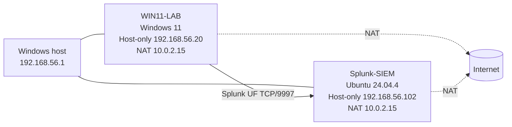

# Architecture

## Overview

The lab uses two VirtualBox VMs and two network planes.



## Network roles

### NAT adapter

Used for internet access from each VM. The validated Ubuntu and Windows guests each received `10.0.2.15` on their own NAT interface. Because VirtualBox NAT is per-VM, identical guest-side NAT addresses are normal and do not imply a conflict between the VMs.

### Host-only adapter

Used for stable lab communication among the Windows host and the VMs.

Validated addresses:

| System | Address | Purpose |
|---|---:|---|
| Windows host | `192.168.56.1` | Browser/SSH access to lab VMs |
| WIN11-LAB | `192.168.56.20` | Monitored Windows endpoint |
| Splunk-SIEM | `192.168.56.102` | Splunk Web and forwarder receiver |

The Host-only adapters intentionally do not need a default gateway. Internet routing remains on the NAT adapters.

## Data flow

```text
Windows process / network activity
        |
        v
Sysmon + Windows Event Logs
        |
        v
Splunk Universal Forwarder
        |
        | TCP/9997 over 192.168.56.0/24
        v
Splunk Enterprise receiver
        |
        v
index=main
        |
        v
SPL investigation
```

The Windows endpoint was configured to forward at least:

- `WinEventLog:Application`
- `WinEventLog:Security`
- `WinEventLog:System`
- `WinEventLog:Microsoft-Windows-Sysmon/Operational`

Sysmon was sent with `renderXml = true`, producing the sourcetype:

```text
XmlWinEventLog:Microsoft-Windows-Sysmon/Operational
```

Because the official Splunk Add-on for Sysmon was not part of the validated baseline, some searches in this repository extract XML fields with `rex`.

## Ports

| Port | Direction | Purpose |
|---|---|---|
| TCP/8000 | Host -> Splunk-SIEM | Splunk Web |
| TCP/9997 | WIN11-LAB -> Splunk-SIEM | Universal Forwarder receiving port |
| TCP/22 | Host -> Splunk-SIEM | SSH administration |

A temporary NAT SSH port-forward (`127.0.0.1:2222 -> guest:22`) was used during initial setup before Host-only networking was healthy. It is not required once `192.168.56.102` is reachable directly.

## Least-privilege model

Splunk Universal Forwarder 10.4.2 used the virtual service identity:

```text
NT SERVICE\SplunkForwarder
```

That identity could read the normal Windows logs but initially could not subscribe to the Sysmon Operational channel. Sysmon's ACL already granted read access to the built-in Event Log Readers group (`S-1-5-32-573`), so the correct repair was to add the Splunk service identity to that group and restart the service.

This preserved least privilege and avoided changing the service to LocalSystem.
